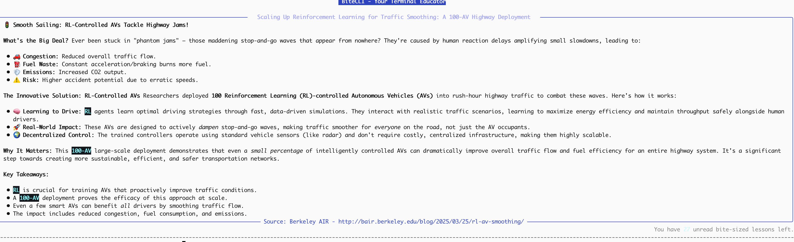

# BiteCLI - Your Terminal Educator



BiteCLI is a beautifully crafted command-line tool that brings bite-sized educational content to your terminal every time you open it. It aggregates content from top engineering blogs and AI research feeds, summarizes them into a 200-300 word lesson using an LLM of your choice (Gemini, OpenAI, Claude, Perplexity), and presents it elegantly using `rich`. It features a smart tracking system so you never read the same lesson twice.

## Requirements
- Python >= 3.8

## Installation

The easiest way to install, configure background updates, and wire it into your terminal is using the 1-click installer:

```bash
chmod +x install.sh
./install.sh
```

**What the installer does:**
1. Creates a dedicated, isolated Python virtual environment in `~/.bitecli/venv`.
2. Adds `bitecli serve --hook` to your `~/.zshrc` or `~/.bashrc` automatically.
3. Sets up a daily background `cron` job to fetch new articles without slowing down your terminal.
4. Performs the initial fetch immediately.

*(If you prefer manual setup, you can still install via `pip install .` and configure hooks/cron yourself).*

### Uninstallation

If you ever want to remove BiteCLI, simply run the included uninstall script to clean up the environment, database, and cron job:

```bash
chmod +x uninstall.sh
./uninstall.sh
```

## Configuration (API Keys & Providers)

Before you fetch or read content, configure your LLM provider. By default, it uses **Google Gemini**, but you can easily switch.

### 1. Set your API Key
Grab your API key from Google AI Studio, OpenAI, Anthropic, or Perplexity.
```bash
bitecli config --key "YOUR_API_KEY_HERE"
```

### 2. (Optional) Change Provider
If you want to use Claude instead of Gemini, change the provider then set the key:
```bash
bitecli config --provider claude
bitecli config --key "YOUR_CLAUDE_KEY"
```

*(Supported providers: `gemini`, `openai`, `claude`, `perplexity`)*

You can view your current configuration simply by running:
```bash
bitecli config
```

## Usage

### Fetching Content

Refresh your local database with the latest articles from your configured RSS feeds (by default: OpenAI Blog, Berkeley AIR, GitHub Engineering, Netflix Tech):
```bash
bitecli fetch
```

### Serving a Lesson

To summarize and read the next unread article:
```bash
bitecli serve
```
*(The article will automatically be marked as read)*

### Automating the Educational Experience

The best way to use BiteCLI is to hook it into your terminal startup script (`~/.zshrc` or `~/.bashrc`) so you naturally get a bite-sized lesson every day. Run the following command for instructions tailored to your shell:
```bash
bitecli hook
```

*(This will typically tell you to add `bitecli serve --hook` to the bottom of your rc file).*

## Features Overview
- **RSS Parser**: Automatically formats messy HTML from blogs into clean summary prompts.
- **SQLite Cached Tracking**: Everything is cached in `~/.bitecli/bitecli.db` and state is maintained locally.
- **Dynamic Summaries**: API prompts specifically designed to compress technical concepts into short, focused takeaways.
- **Aesthetic Terminal UI (TUI)**: Powered by `rich` panels and markdown rendering.
